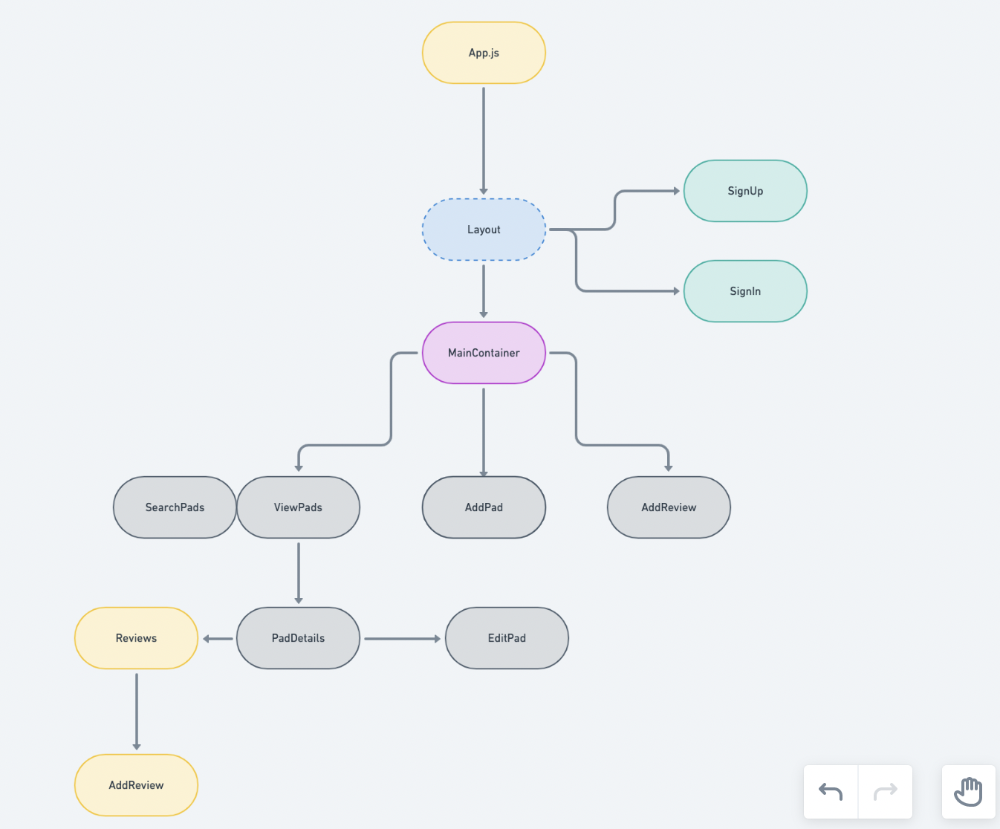
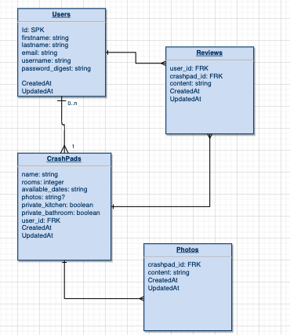

# CrashPad


<br>

## Overview

_**CrashPad** is a community house sharing experience for climbers, and outdoorsy people. The goal is to create a space where you can find a place to crash around the country when visiting crags outside of your local area. Users will have the ability to make an account, and add their home as a CrashPad for others to crash at. Users can search for a crashpad by location, and contact the host to negotiate a time to stay and for how long, pricing can be negotiated, or trade for cooking/cleaning or work._


<br>

## MVP

> Users will have the ability to make an account, and add their home as a CrashPad for others to crash at. Users can search for a crashpad by location,and contact the host to negotiate nights they will be staying. 


<br>

### Goals

- _Full auth_
- _Full CRUD_
- _Association between users and listings_
- _Highly styled_


<br>

### Libraries and Dependencies

> Use this section to list all supporting libraries and dependencies, and their role in the project. Below is an example - this needs to be replaced!

|     Library      | Description                                |
| :--------------: | :----------------------------------------- |
|      React       | _The core structure of the front end._ |
|   React Router   | _Allow routing to different screens/pages._ |
|     Ruby on Rails      | _Backend for RESTful API._ |

<br>

### Client (Front End)

#### Wireframes
[WireFrame](https://xd.adobe.com/view/aa682a88-9608-4af4-892b-28bd402a0080-ff3b/)
#### Component Tree




#### Component Architecture

> Use this section to define your React components and the data architecture of your app. This should be a reflection of how you expect your directory/file tree to look like. 

``` structure

src
|__ screens/
      |__ Landing
      |__ All/Search
      |__ Reviews/Details
      |__ AddReview(modal maybe)
      |__ 
|__ components/
      |__ Header.jsx
      |__ Footer.jsx
      |__ Layout.jsx
      |__ Pad.jsx
|__ services/
      |__ api-config.js
      |__ auth.js
      |__ pads.js
      |__ ratings.js?

```

#### Time Estimates

> Use this section to estimate the time necessary to build out each of the components you've described above.

| Task                | Priority | Estimated Time | Time Invested | Actual Time |
| ------------------- | :------: | :------------: | :-----------: | :---------: |
| Setting Up Basic Layout | H | 2 Hr |  2Hr |2 hr|
| Creating API | H | 3 Hr |3 Hr | 3 Hr |
| Testing API | H | 2 Hr |  1Hr |1hr |
| Deploy API | H | 3 Hr |  1Hr | 1hr| 
| React Route/Links | H | 3 Hr |  3Hr | 3hr| 
| React Pad/Review Component | H | 3 Hr |  3Hr | 3hr|
| React/JS post/put/delete calls | H | 3 Hr |  2Hr | 2hr|
| React Header/Footer | M | 3 Hr |  1Hr | 1hr|
| CSS Styling MOBILE | H | 3 Hr | 4 Hr | 4hr|
| CSS Styling DESKTOP/Tablet | H | 3 Hr |  5Hr | 5hr|  
| CSS breakpoints | M | 3 Hr |  3Hr |3hr| 
| Testing React Components | H | 3 Hr |  4Hr | 4h| 
| Hosting MVP | M | 3 Hr |  1Hr |1hr| 
| Total Time | |  Hrs | 31Hrs | 33hr|

<br>

### Server (Back End)

#### ERD Model



<br>

***

## Post-MVP

Link this with my p2, so that people can find places to stay near a climb they were looking at on spotter. <br>
Add more to reviews. <br>
Add a virtual currency exchange and legitimize booking on the site. <br>

***

## Code Showcase

one of the things I was most proud of on this project was adding multiple photos in the edit screen, and allowing users to remove photos from the database or add new ones through nested attributes. This was a tricky problem to remove them from both state and the DB so that the user could see which photos were being removed/added in real time.
```javascript
//this delete checks to see if the image has an id, if it does that means it was added previously and is in the database, in order to remove it we must make an api 

//call to the photos table for that specific photo. If it doesn't have an id that means it has just been added in state, therefore we can just splice it from the 

//formData state array.
 const deleteImage = (e) => {
    if (formData.photos_attributes[e.target.value].id) {
      handlePhotoDelete(formData.photos_attributes[e.target.value].id);
      formData.photos_attributes.splice(e.target.value, 1);
      setFormData({ ...formData });
    } else {
      formData.photos_attributes.splice(e.target.value, 1);
      setFormData({ ...formData });
    }
  };
  
  //In order to add photos to the photo table via nested_attributes on rails, the photos had to be packaged seperately and then added to the form data as an array
 //of objects. This function sets the formData with the previous state, and adds to the photos_attributes array a nested object with the key url, and a string
 //value which is the image just added.
  
   function handleImage(e) {
    setFormData((prevState) => ({
      ...prevState,
      photos_attributes: [...photos_attributes, { url: imageAdd }],
    }));
    setImageAdd("");
  }
```


## Code Issues & Resolutions

